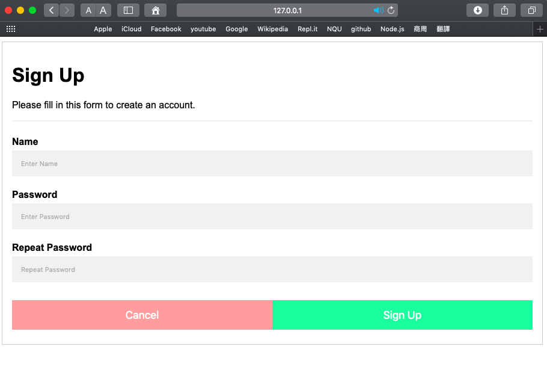
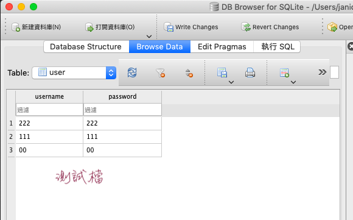
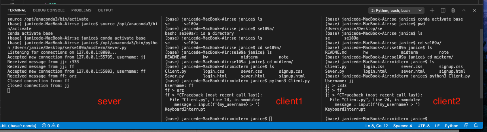
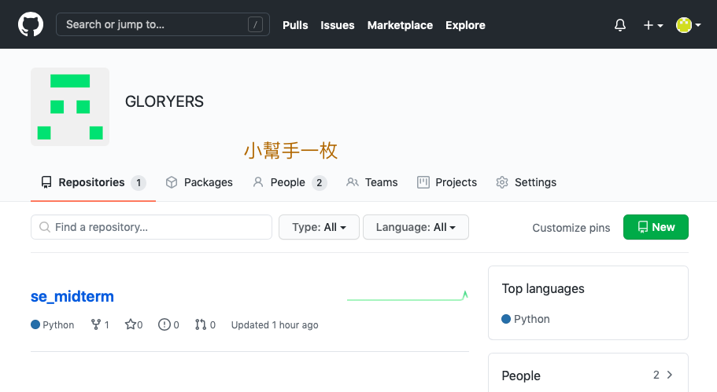
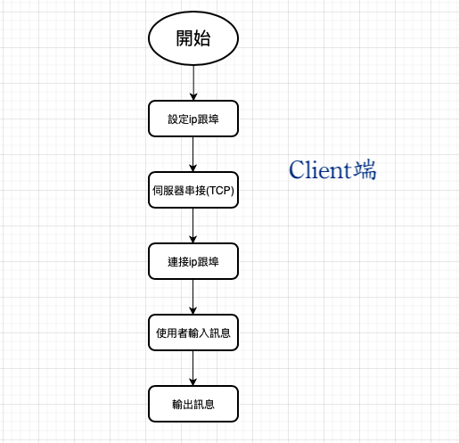
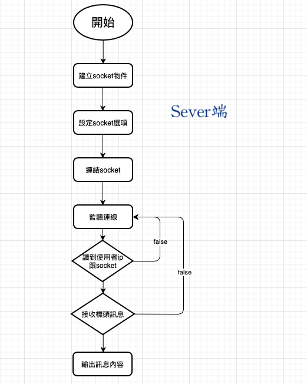
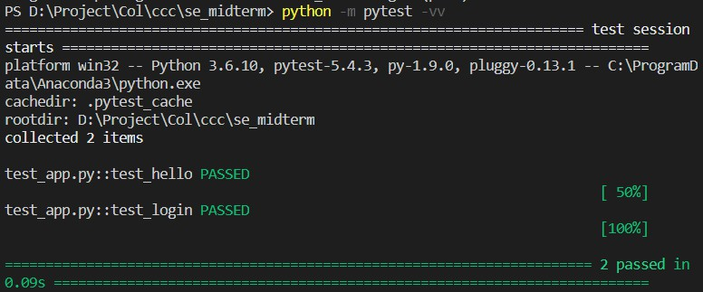

# 期中作業_聊天室

## 專案網址
[GLORYERS](https://github.com/GLORYERS/se_midterm)

## 組員
110810535 張嘉芸

測試小幫手一枚

## 登入

## 註冊

## 資料庫
＊註冊的資料會傳入資料庫中

## 聊天室

＊尚未完成網頁端的聊天室,期望完成能訊息刷新的畫面

## 專案畫面

## 演算法

## 分配工作
除測試有測試小幫手,其餘皆一人完成

## 測試
Testing using pytest

Test file: [conftest.py](https://github.com/GLORYERS/se_midterm/blob/main/conftest.py), [test_app.py](https://github.com/GLORYERS/se_midterm/blob/main/test_app.py)

## 參考資料
1.https://pythonprogramming.net/server-chatroom-sockets-tutorial-python-3/

2.https://pythonprogramming.net/client-chatroom-sockets-tutorial-python-3/?completed=/server-chatroom-sockets-tutorial-python-3/

3.https://blog.techbridge.cc/2017/06/03/python-web-flask101-tutorial-introduction-and-environment-setup/

4.https://ithelp.ithome.com.tw/articles/10222132

5.https://clay-atlas.com/blog/2019/10/15/python-chinese-tutorial-socket-tcp-ip/

6.https://codertw.com/程式語言/374180/
