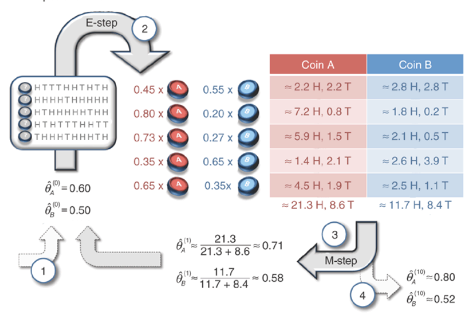

# EM algorithm (Expectation-maximization algorithm)

## E step
Current bias estimates:&nbsp;&nbsp;θA=0.6,&nbsp;&nbsp;θB=0.5

In second row of toss: 
lA = (10!/9!) * (θA^9) * ((1 - θA)^1) = 0.004 
lB = (10!/9!) * (θB^9) * ((1 - θB)^1) = 0.001  
pA = lA / (lA + lB) = 0.8 
pB = lB / (lA + lB) = 0.2  
headA = pA * 9 = 7.2 
tailA = pA * 1 = 0.8 
headB = pB * 9 = 1.8 
tailB = pB * 1 = 0.2 

## M step
Update θA and θB with the new values 
θA' = 21.3/(21.3 + 8.6) = 0.71 
θB' = 11.7/(11.7 + 8.4) = 0.58

## Do the E and M until convergence

http://karlrosaen.com/ml/notebooks/em-coin-flips/
