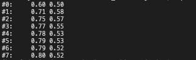

# EM algorithm (Expectation-maximization algorithm) 

## 簡介：
```
最大期望演算法，一種以迭代的方式來解決一類特殊最大似然問題的方法，這類問題通常是無法直接求得最優解，
但是如果引入隱含變量，在己知隱含變量的值的情況下，就可轉化為簡單的情況，直接求得最大似然解。
```
## 核心概念：
```
你知道一些資料(觀察到的數據)，你不知道另一些資料(觀察不到的數據)，你想知道那些不知道的資料，
於是你就根據假設先猜，得到一筆數據後(E-Step)，反思並更新原本的假設，期望讓觀察到的數據可能性更高(M-Step)；
然後重複猜與反思的過程，最後便能得到一個可以解釋大概率數據的假設。

分為兩步: Exceptions-Step 和 Maximization-Step，
E-Step透過觀察資料和現有模型來估計參數，然後用此參數值去計算似然函數的期望值;
M-Step是尋找似然函數最大化對應的參數，因每次迭代後似然函數都會增加，所以函數最終會逐漸收斂。
```


以下舉Nature Biotech 的 EM tutorial 文章為例：


產生硬幣A跟硬幣B隨機拋擲的結果後，加入隱變數，並抹去之前隨機拋擲結果中的硬幣A跟B標示。

加入隱變數後，無法估計和之值，亦無法估計隱變數，所以無法使用最大似然估計法估算出隱變數。

解決方法：先隨機初始化和，用去估計隱變數，然後基於隱變數按最大似然估計新的和直至收斂。

----------------------------------------------------------------------------------

## E step:

Current bias estimates:&nbsp;&nbsp;θ<sub>A</sub>=0.6,&nbsp;&nbsp;θ<sub>B</sub>=0.5

In second row of toss:<br>
l<sub>A</sub> = (10!/9!) * (θ<sub>A</sub>^9) * ((1 - θ<sub>A</sub>)^1) = 0.004<br>
l<sub>B</sub> = (10!/9!) * (θ<sub>B</sub>^9) * ((1 - θ<sub>B</sub>)^1) = 0.001<br><br>
p<sub>A</sub> = l<sub>A</sub> / (l<sub>A</sub> + l<sub>B</sub>) = 0.8<br>
p<sub>B</sub> = l<sub>B</sub> / (l<sub>A</sub> + l<sub>B</sub>) = 0.2<br><br>
head<sub>A</sub> = p<sub>A</sub> * 9 = 7.2<br>
tail<sub>A</sub> = p<sub>A</sub> * 1 = 0.8<br>
head<sub>B</sub> = p<sub>B</sub> * 9 = 1.8<br>
tail<sub>B</sub> = p<sub>B</sub> * 1 = 0.2<br>


## M step:

Update θ<sub>A</sub> and θ<sub>B</sub> with the new values:<br>
θ<sub>A</sub>' = 21.3/(21.3 + 8.6) = 0.71<br>
θ<sub>B</sub>' = 11.7/(11.7 + 8.4) = 0.58

### Do the E and M step until convergence.



## 複雜度:
```
迭代一次的複雜度是：O(n*m)

n = 資料集裡需要處理的數據

m = 一圈迴圈

迭代多次的複雜度是：O(n*k)

k = 執行k次的迴圈
```
## 測試：


## 補充(高斯混合模型)：

高斯混合模型是由多個常態分佈組合成的概率模型。


## 參考資料:

1. https://blog.pluskid.org/?p=81

2. https://zhuanlan.zhihu.com/p/78311644

3. https://zh.m.wikipedia.org/wiki/正态分布

4. https://www.zhihu.com/question/27976634

5. http://karlrosaen.com/ml/notebooks/em-coin-flips/

6. https://medium.com/@prateek.shubham.94/expectation-maximization-algorithm-7a4d1b65ca55

7. A. P. Dempster; N. M. Laird; D. B. Rubin. "Maximum Likelihood from Incomplete Data via the EM Algorithm". Journal of the Royal Statistical Society.Series(Methodological), Vol. 39,No.1.(1977),pp.1–38. JSTOR 2984875. MR 0501537.
